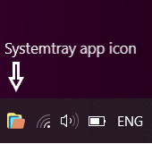
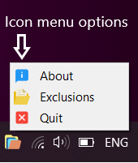
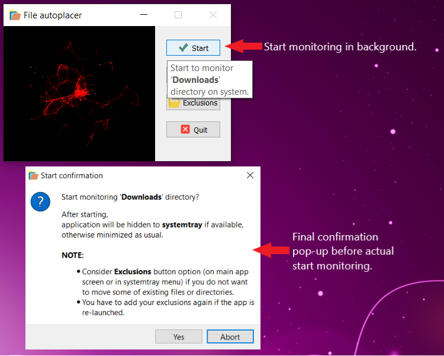
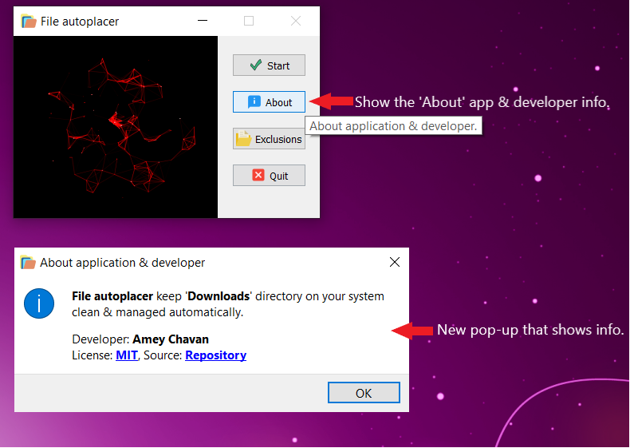
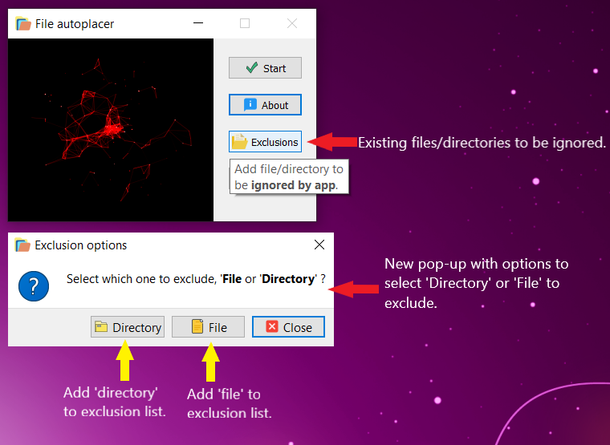
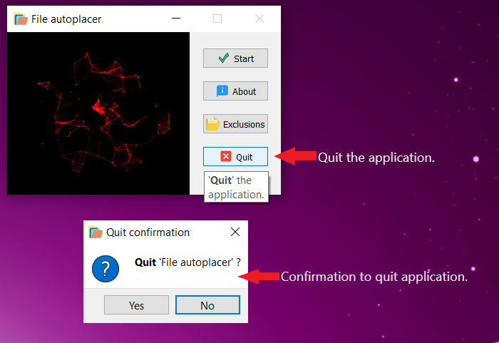
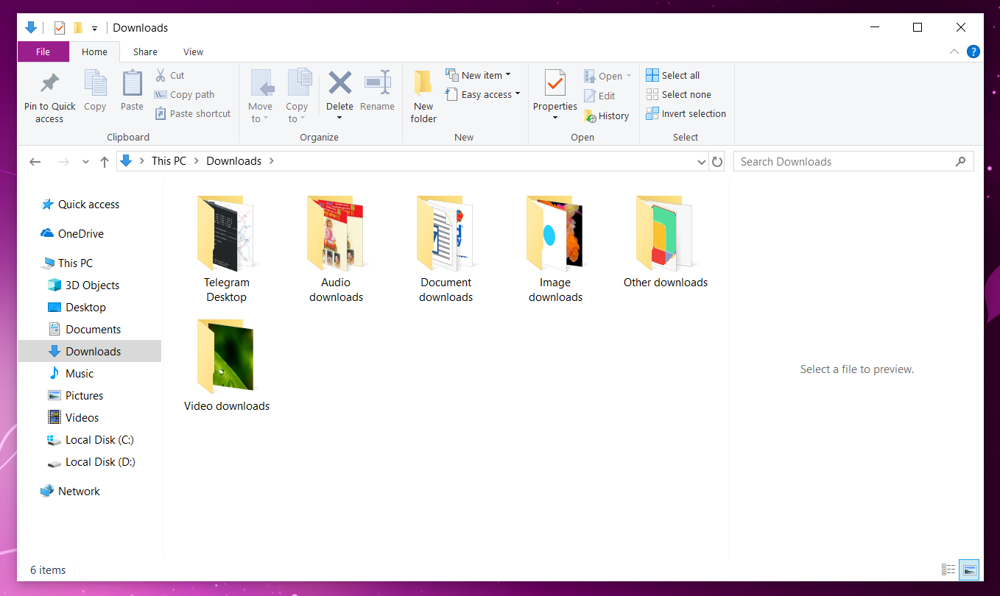

# File-autoplacer
Keep '**Downloads**' directory clean &amp; managed on given platform system (such as Linux, BSD, macOS, Windows etc).

### Technologies:
- [Python](https://www.python.org/) (>= 3.7)
- [PyQt5](https://pypi.org/project/PyQt5/)

*See '**requirements.txt**' for detailed information about all dependencies with their version used.*

### Application GUI screens:

<H3>Main/launch screen with some animation:</H3>

- **Systemtray app icon (added only if systemtray is available):**

- **Systemtray app icon menu options (only if systemtray icon was added):**

- **"Start monitoring" function:**

- **"About" function:**

- **"Exclusions" function:**

- **"Quit" function:**

- **Finally well managed & clean "Downloads" directory on system:**

