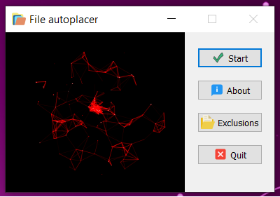

# File-autoplacer
Keep "**Downloads**" directory clean &amp; managed on given platform system (such as Linux, BSD, macOS, Windows etc).

### Technologies:
- [Python](https://www.python.org/) (>= 3.7)
- [PyQt5](https://pypi.org/project/PyQt5/)

*See '**requirements.txt**' for detailed information about all dependencies with their version used.*

### Application GUI screen:
- **Main/launch screen with some animation:**

