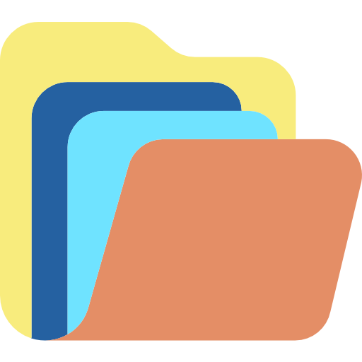

# File-autoplacer
Keep '**Downloads**' directory clean &amp; managed on given platform system (such as Linux, BSD, macOS, Windows etc).

### Technologies:
- [Python](https://www.python.org/) (>= 3.7)
- [PyQt5](https://pypi.org/project/PyQt5/)

*See '**requirements.txt**' for detailed information about all dependencies with their version used.*

<H2><U>Application GUI screens:</U></H2>
<H4 align="center">Main/launch screen with some animation:</H4>

 
<H4 align="center">Systemtray app icon (added only if systemtray is available):</H4>

 
<H4 align="center">Systemtray app icon menu options (only if systemtray icon was added):</H4>

<H4 align="center">"Start monitoring" function:</H4>

 
<H4 align="center">"About" function:</H4>

 
<H4 align="center">"Exclusions" function:</H4>

 
<H4 align="center">"Quit" function:</H4>

 
<H4 align="center">Finally well managed & clean "Downloads" directory on system:</H4>

